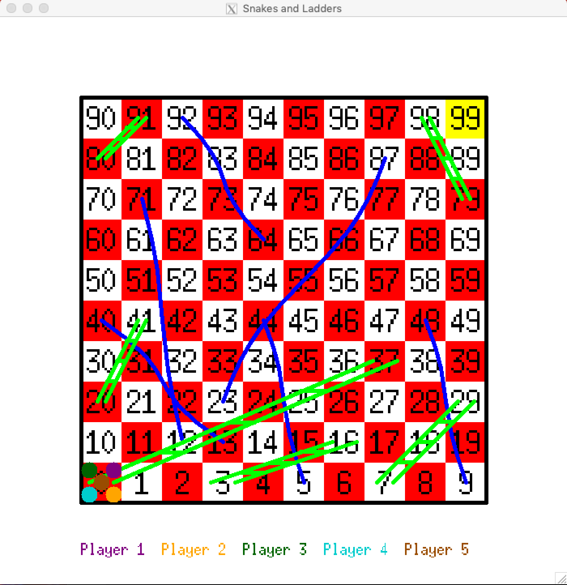
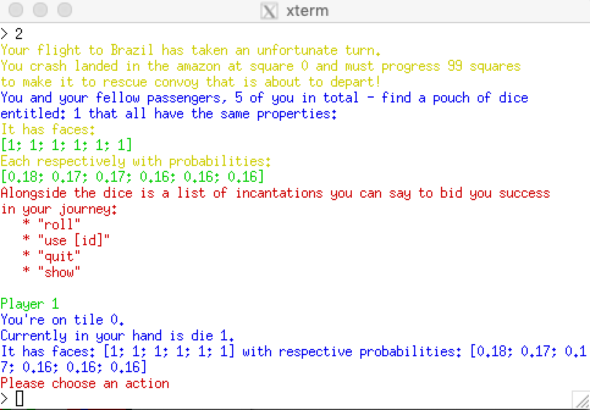

# Snakes-and-Ladders

A final project for [CS 3100](cs3110.org) developed by 
- Aliva Das
- Vianca Hurtado
- Luis Londono

## What is it?
Snakes-and-Ladders is a terminal based multi-player game inspired by the popular board game snakes and ladders - with our own twists. 

 

Game Backstory: The players have gotten stranded in the Amazon after a plane crash, and can reach the rescue convoy by making it to the last tile on the board. Players are able to pick up different dice along the board that are available at different tiles on the board. These dice will be added and stored to the players inventory for the rest of the game. At each player’s turn, the currently selected die will be randomly rolled and the output will be displayed on the game screen. Players can choose between the dice in their inventory as well as communicate with the game through commands in their terminal. This allows for a decision problem to arise that adds strategy to the game. The player moves forward with the number of steps on the selected die. The ladders and snakes are one-way, they only go from one tile to the other in one direction. For the ladders, it will be from the tile at the bottom to the tile at the top of the ladder. For the snakes, it will be from the tile at the snake’s mouth to the one at its tail. The ladders take you forward, while the snakes take you back. 

Snakes-and-Ladders features
- Customizable boards
- Customizable dice with faces and probabilities
- A bot that can be selected as extra players in game
- A graphics window displaying the board along with the tile numbers, snakes, ladders as well as the positions of the players
